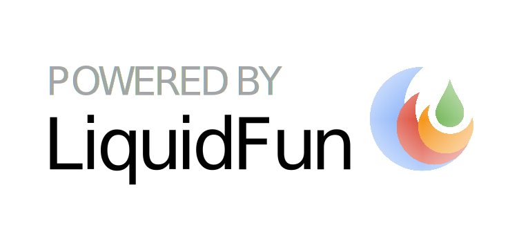

サーモンタワーバトル
====
『サーモンラン』に登場するモンスターたちを台の上に1匹ずつ積み上げていき、モンスターが台から落ちたらゲーム終了⋯⋯というシンプルなゲーム。Firebaseを用いたオンライン対戦にも対応する。

# 概要

このゲームは、Nintendo Switch用のゲームソフト『Splatoon2』のゲームモード『サーモンラン』と、スマートフォン向けアプリ『どうぶつタワーバトル』をモチーフにして作成された。

# ライブラリ

このゲームは以下のライブラリを含む。

- **物理演算** - LiquidFun (リキッドファン)
- **描画** - EaselJS (イーゼルジェイエス)
- **通信** - Firebase (ファイアーベース)

## 物理演算：LiquidFun

Google謹製のライブラリ。JSの2D物理演算ライブラリの定番である『Box2D』を拡張して作られた。リキッド･ファンの名の通り、流体のシミュレーションを得意とする。

JSの物理演算ライブラリとしては最終アップデートが比較的最近で、評価も良いようなのでとりあえず使用した。しかし、サーモンタワーバトルの実装だけを考えれば明らかにオーバースペックであり、ファイルサイズが巨大。グローバル領域にworldを定義してやらないとエラーが出る（おそらくバグ）。asm.jsでWORNを吐く。LiquidFunのせいかは不明だが、ブラウザによって演算結果に違いが出る。などの問題に遭遇したので、他のライブラリをもう少し検討すべきだったかと思う。

## 描画：EaselJS

JSでリッチな描画表現を行うためのライブラリ『CreateJS』のうち、HTML5 Canvasの描画を担当する部分。

昔からあるライブラリ。個人的になじみ深く、近年WebGLにも対応したようなので使用した。

## 通信：Firebase

Firebaseが提供するサービスのひとつ『Realtime Database』を利用することで、ユーザーがWebページ上でリアルタイムにJSONファイルを同期することができるようになる。同期の際に発火する様々なイベントを検知してゲームを動かすことで、通信対戦が可能。

部屋情報や操作情報を送り合うために使用した。あくまで「JSONを同期する」ための機能なので、フレーム単位の細かい操作の同期をとるのには使えない。

# メモ

| コマンド | 作用 |
| ---- | ---- |
| npm run build | ./docs/js/index.js をエントリーポイントにしてjsファイルを結合･圧縮し、./docs/js/bundle.js に出力する。 |
| npm run serve | ローカルサーバーを起動する。 |
| npm run deploy | firebaseのサーバーに ./docs 下のファイルをアップロードする。 |
| npm run deploy-rules | firebaseのデータベースに ./database.rules.json をアップロードする。 |
| npm run open | firebaseのサーバーで公開されている自分のWebサイトにアクセスする。 |